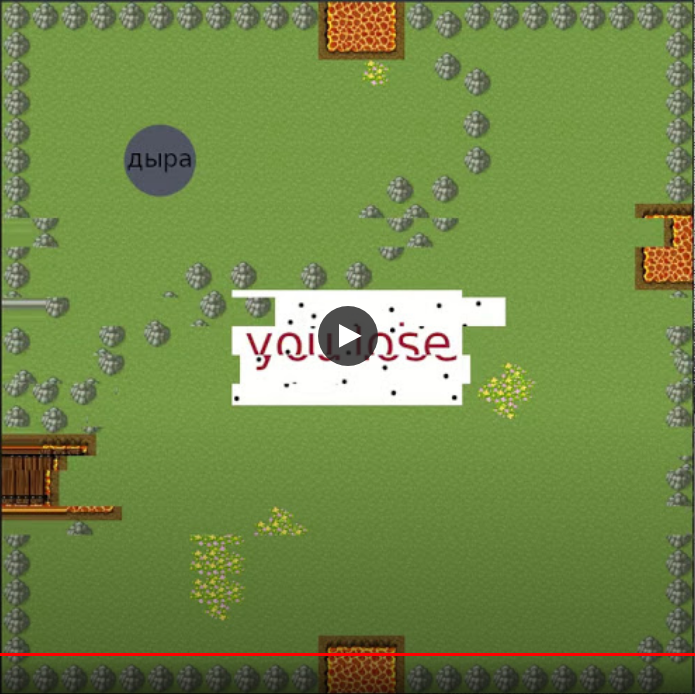

# Interactive 2D-graphics

[](
    https://drive.google.com/file/d/1N9liUsIJ7AyKvfOsFQDqwgdOqgTHmSja/view?usp=sharing 
    "game video - click to watch"
)

## how to install
```
$ sudo apt-get install cmake
$ sudo apt-get install libglfw3-dev

$ cmake .
$ make
$ ./bin/main
```

## game
The player should find an exit out of the labyrinth in one of the rooms.
Along the way the player should collect the logs 
because they are required to build bridges over lava. 
The player die if he try to stand on lave or on water.


## resources used
- https://pixanna.nl/materials/celiannas-tileset/
- https://pipoya.itch.io/pipoya-free-rpg-world-tileset-32x32-40x40-48x48
- https://free-game-assets.itch.io/free-rpg-desert-tileset

## how to run on MacOS
To run the game on MacOS you need to replace the line 
`<target_link_libraries(main LINK_PUBLIC ${OPENGL_gl_LIBRARY} glfw rt dl)>` 
with the line 
`<target_link_libraries(main LINK_PUBLIC ${OPENGL_gl_LIBRARY} glfw dl)>` 
in CMakeLists.txt
